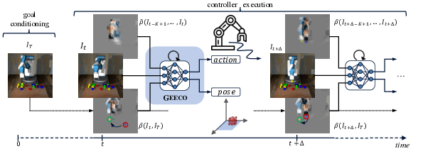

# GEECO - Goal-Conditioned End-to-End Visuomotor Control


This repository contains the official implementation of [Goal-Conditioned End-to-End Visuomotor Control for Versatile Skill Primitives](https://arxiv.org/abs/2003.08854) which was presented at ICRA 2021. A video of the presented slides can be found [here](http://shapestacks-file.robots.ox.ac.uk/static/download/geeco/geeco-icra21.mp4).

It provides the model implementation in Tensorflow 1.15 and scripts for training and evaluation of the visuomotor controller in simulation. The simulation environments are built with [MuJoCo 2.0](https://www.roboti.us/index.html) which requires a separate license. All main scripts can be found in [scripts/](scripts).

If you use the GEECO model, datasets or simulation environments in your work, please cite our work as:
```
@inproceedings{groth2021geeco,
  author={Oliver Groth and Chia-Man Hung and Andrea Vedaldi and Ingmar Posner},
  booktitle={2021 IEEE International Conference on Robotics and Automation (ICRA)}, 
  title={Goal-Conditioned End-to-End Visuomotor Control for Versatile Skill Primitives}
}
```


## Installation

This repository requires the following software to be installed:
- Python>=3.7
- conda>=4.10
- MuJoCo==2.0 (installed in `${HOME}/.mujoco/mujoco200` such that `mujoco-py` can find it)

The installation of the conda environment can be done conveniently via:
```bash
./setup_conda_env.sh
```

It can also be installed manually using `environment.yml`. If set up manually, it is important to export the root of the repository as an environment variable `GEECO_ROOT` and put `${GEECO_ROOT}/src` on your `PYTHONPATH` for the scripts to work.

In order to run any scripts from this repository, please do:
```bash
conda activate geeco
cd ${GEECO_ROOT}/scripts
```


## GEECO-Gym Simulation Environment
The [pushing](scripts/gym_pushing.py) and [pick-and-place](scripts/gym_pickplace.py) simulation environments can be executed via
```bash
LD_PRELOAD="/usr/lib/x86_64-linux-gnu/libGLEW.so" python gym_pushing.py \
  --rendering_mode viewer
```
and via
```bash
LD_PRELOAD="/usr/lib/x86_64-linux-gnu/libGLEW.so" python gym_pickplace.py \
  --rendering_mode viewer
```

The default parameters spawn a mujoco-py GUI and execute random expert demonstrations of the respective task. The `LD_PRELOAD=...` path prefix should be added to the run when `--rendering_mode viewer` is active to ensure that `mujoco-py` uses the correct graphics library.

The simulation scripts can be used to collect data, replay a recorded replay buffer and run a controller model. Please refer to the CLI documentation in the respective `argparse.ArgumentParser` of each script for further details.


## Datasets


The datasets used in the experiments of our ICRA 2021 paper can be downloaded here:
- [[gym-pick-pad2-cube2](http://shapestacks-file.robots.ox.ac.uk/static/download/geeco/gym-pick-pad2-cube2-v4.tar.gz)]
[[md5](http://shapestacks-file.robots.ox.ac.uk/static/download/geeco/gym-pick-pad2-cube2-v4.tar.gz.md5)]
- [[gym-push-pad2-cube2](http://shapestacks-file.robots.ox.ac.uk/static/download/geeco/gym-push-pad2-cube2-v4.tar.gz)]
[[md5](http://shapestacks-file.robots.ox.ac.uk/static/download/geeco/gym-push-pad2-cube2-v4.tar.gz.md5)]
- [[gym-pick-pad2-cube2-clutter12](http://shapestacks-file.robots.ox.ac.uk/static/download/geeco/gym-pick-pad2-cube2-clutter12-v4.tar.gz)]
[[md5](http://shapestacks-file.robots.ox.ac.uk/static/download/geeco/gym-pick-pad2-cube2-clutter12-v4.tar.gz.md5)]
- [[gym-pick-nut-cone](http://shapestacks-file.robots.ox.ac.uk/static/download/geeco/gym-pick-nut-cone-v4.tar.gz)]
[[md5](http://shapestacks-file.robots.ox.ac.uk/static/download/geeco/gym-pick-nut-cone-v4.tar.gz.md5)]
- [[gym-pick-ball-cup](http://shapestacks-file.robots.ox.ac.uk/static/download/geeco/gym-pick-ball-cup-v4.tar.gz)]
[[md5](http://shapestacks-file.robots.ox.ac.uk/static/download/geeco/gym-pick-ball-cup-v4.tar.gz.md5)]

Please find below the command line instructions for setting them up (on the example of `gym-pick-pad2-cube2`):
```bash
cd ${GEECO_ROOT}/data
wget http://shapestacks-file.robots.ox.ac.uk/static/download/geeco/gym-pick-pad2-cube2-v4.tar.gz  # download dataset
http://shapestacks-file.robots.ox.ac.uk/static/download/geeco/gym-pick-pad2-cube2-v4.tar.gz.md5  # download archive checksum
md5sum -c gym-pick-pad2-cube2-v4.tar.gz.md5  # check that download is OK
tar -xvf gym-pick-pad2-cube2-v4.tar.gz  # unpack dataset
```

By default, all scripts expect datasets to live in `${GEECO_ROOT}/data`.


## Pre-Trained Models
The pre-trained models from our ICRA 2021 paper can be downloaded here:
[[models](http://shapestacks-file.robots.ox.ac.uk/static/download/geeco/geeco_models_icra21.tar.gz)]
[[md5](http://shapestacks-file.robots.ox.ac.uk/static/download/geeco/geeco_models_icra21.tar.gz.md5)]

Please find below the command line instructions for setting them up:
```bash
cd ${GEECO_ROOT}
wget http://shapestacks-file.robots.ox.ac.uk/static/download/geeco/geeco_models_icra21.tar.gz  # download model checkpoints
wget http://shapestacks-file.robots.ox.ac.uk/static/download/geeco/geeco_models_icra21.tar.gz.md5  # download download archive checksum
md5sum -c geeco_models_icra21.tar.gz.md5  # check that download is OK
tar -xvf geeco_models_icra21.tar.gz  # unpack all pretrained models under ${GEECO_ROOT}/models
```

By default, all scripts expect models to live in `${GEECO_ROOT}/models`.


## Model Training
In order to train a GEECO model or any of its ablations, please execute the [training script](scripts/train_e2evmc.py) similar to the following example:
```bash
python train_e2evmc.py \
  --dataset_dir ../data/gym-pick-pad2-cube2-v4 \
  --split_name balanced \
  --model_dir ../tmp/models/geeco-f \
  --observation_format rgb \
  --goal_condition target \
  --proc_obs dynimg \
  --proc_tgt dyndiff \
  --lr 1e-4 \
  --train_epochs 20 \
  --num_last_ckpt 2 \
  --num_best_ckpt 1
```

Once log data is written to `--model_dir`, a tensorboard service can be launched on this directory to track the metrics logged during training, e.g.:
```bash
cd ${GEECO_ROOT}
tensorboard --logdir tmp/models/geeco-f
```

During training, the following elements of `--dataset_dir` are used:
- `data/*.tfrecord.zlib`: The recorded demo data. Each record contains one demo episode.
- `splits/${split_name}/{train,eval}.txt`: The split lists specifying which tfrecord goes into which split.
- `meta/meta_info.json`: The meta information to parse the tfrecord, used by the tensorflow data loader.


## Model Evaluation


In the section below, you find the script calls to replicate the experiments from our ICRA 2021 paper. Those script invocations can serve as examples for running custom controller models in a GEECO gym simulation.

During an evaluation run, the following arguments are crucial for a correct setup:
- `--shapes`: Loads the specified shape set. This needs to match with the shapes specified in the CSV file provided via `--init_states`.
- `--init_states`: Points to the initial configurations for each episode in a CSV file.
- `--dataset_dir`: Points to the root directory of the dataset.
- `--tfrecord_list`: Points to a list of tfrecords to be looked up for target images. The order of the records needs to match the order provided via `--init_states`, otherwise the target images do not match the episode configuration!

Execute the pick-and-place controller in a standard scenario:
```bash
python gym_pickplace.py \
  --wrk_dir ../logs/geeco-f-pick22 \
  --sim_mode controller \
  --shapes pad2-cube2 \
  --goal_condition target \
  --init_states ../data/gym-pick-pad2-cube2-v4/splits/balanced/init-test.csv \
  --dataset_dir ../data/gym-pick-pad2-cube2-v4 \
  --tfrecord_list ../data/gym-pick-pad2-cube2-v4/splits/balanced/test.txt \
  --start_idx 0 --end_idx 1000 \
  --model_dir ../models/geeco-f-pick22 \
  --observation_format rgb \
  --rendering_mode video
```

Execute the pushing controller in a standard scenario:
```bash
python gym_pushing.py \
  --wrk_dir ../logs/geeco-f-push22 \
  --sim_mode controller \
  --shapes push-pad2-cube2 \
  --goal_condition target \
  --init_states ../data/gym-push-pad2-cube2-v4/splits/balanced/init-test.csv \
  --dataset_dir ../data/gym-push-pad2-cube2-v4 \
  --tfrecord_list ../data/gym-push-pad2-cube2-v4/splits/balanced/test.txt \
  --start_idx 0 --end_idx 1000 \
  --model_dir ../models/geeco-f-push22 \
  --observation_format rgb \
  --rendering_mode video
```

Execute the pick-and-place controller in FG:Clutter:
```bash
python gym_pickplace.py \
  --wrk_dir ../logs/geeco-f-fg_clutter \
  --sim_mode controller \
  --shapes pad2-cube2-clutter12 \
  --goal_condition target \
  --init_states ../data/gym-pick-pad2-cube2-clutter12-v4/splits/fasttest/init-test.csv \
  --dataset_dir ../data/gym-pick-pad2-cube2-clutter12-v4 \
  --tfrecord_list ../data/gym-pick-pad2-cube2-clutter12-v4/splits/fasttest/test.txt \
  --start_idx 0 --end_idx 100 \
  --model_dir ../models/geeco-f-pick22 \
  --observation_format rgb \
  --rendering_mode video
```

Execute the pick-and-place controller in BG:Prisma:
```bash
python gym_pickplace.py \
  --wrk_dir ../logs/geeco-f-bg_prisma \
  --sim_mode controller \
  --shapes pad2-cube2 \
  --goal_condition target \
  --init_states ../data/gym-pick-pad2-cube2-v4/splits/balanced/init-test.csv \
  --dataset_dir ../data/gym-pick-pad2-cube2-v4 \
  --tfrecord_list ../data/gym-pick-pad2-cube2-v4/splits/balanced/test.txt \
  --start_idx 0 --end_idx 1000 \
  --model_dir ../models/geeco-f-pick22 \
  --background_video ../assets/videos/rainbow_loop.mp4 \
  --observation_format rgb \
  --rendering_mode video
```

Execute the pick-and-place controller in NutOnCone:
```bash
python gym_pickplace.py \
  --wrk_dir ../logs/geeco-f-nut_on_cone \
  --sim_mode controller \
  --shapes nut-cone \
  --goal_condition target \
  --init_states ../data/gym-pick-nut-cone-v4/splits/fasttest/init-test.csv \
  --dataset_dir ../data/gym-pick-nut-cone-v4 \
  --tfrecord_list ../data/gym-pick-nut-cone-v4/splits/fasttest/test.txt \
  --start_idx 0 --end_idx 10 \
  --model_dir ../models/geeco-f-pick22 \
  --observation_format rgb \
  --rendering_mode video
```

Execute the pick-and-place controller in BallInCup:
```bash
python gym_pickplace.py \
  --wrk_dir ../logs/geeco-f-ball_in_cup \
  --sim_mode controller \
  --shapes ball-cup \
  --goal_condition target \
  --init_states ../data/gym-pick-ball-cup-v4/splits/fasttest/init-test.csv \
  --dataset_dir ../data/gym-pick-ball-cup-v4 \
  --tfrecord_list ../data/gym-pick-ball-cup-v4/splits/fasttest/test.txt \
  --start_idx 0 --end_idx 10 \
  --model_dir ../models/geeco-f-pick22 \
  --observation_format rgb \
  --rendering_mode video
```


## Custom Dataset Creation
With this repository, we provide the basic tools to create a custom simulation dataset using the GEECO gym simulation. Most tasks during the dataset creation process can be executed using Jupyter notebooks. In order to run them, launch a kernel as follows:
```bash
conda activate geeco
cd ${GEECO_ROOT}/notebooks
jupyter notebook
```

Then, you can use the following tools to generate tasks, record demos, extract target images and create train/val/test splits.
1) [dataset-create_tasks.ipynb](notebooks/dataset-create_tasks.ipynb): This notebook generates initial scene configurations for a given shape set and exports them as a CSV file. Each row corresponds to one initial configuration of the robot arm and the shapes in the scene.
2) The demo tasks specified in a CSV file can be recorded using one of the simulations, e.g. `gym_pickplace.py` in `collect` mode. Below is an example which would re-create the data of the `gym-pick-pad2-cube2-v4` dataset.
```bash
python gym_pickplace.py \
  --wrk_dir ../tmp/data/gym-pick-pad2-cube2-v4 \
  --sim_mode collect \
  --shapes pad2-cube2 \
  --init_states ../data/gym-pick-pad2-cube2-v4/meta/init-pad2-cube2.csv \
  --start_idx 0 --end_idx 4000 \
  --observation_format rgb \
  --rendering_mode tfrecord
```
3) [dataset-extract_keyframes.ipynb](notebooks/dataset-extract_keyframes.ipynb): Once the data has been recorded in tfrecords, this notebook helps to extract the target images which are used for goal specification during model training and evaluation.
4) [dataset-create_splits.ipynb](notebooks/dataset-create_splits.ipynb): This notebook generates a data partitioning into train/val/test sets.
5) [dataset-visualize.ipynb](notebooks/dataset-visualize.ipynb): Once the dataset is created (including at least one split), this notebook can be used to visualize the recorded data using the same data loader function which is subsequently used during model training.


## Acknowledgements
This work was funded by the European Research Council under grant ERC 677195-IDIU and an EPSRC Programme Grant (EP/M019918/1).
The authors acknowledge the use of Hartree Centre resources in this work. The STFC Hartree Centre is a research collaboratory in association with IBM providing High Performance Computing platforms funded by the UK’s investment in e-Infrastructure.
The authors also acknowledge the use of the University of Oxford Advanced Research Computing (ARC) facility in carrying out this work(http://dx.doi.org/10.5281/zenodo.22558).
